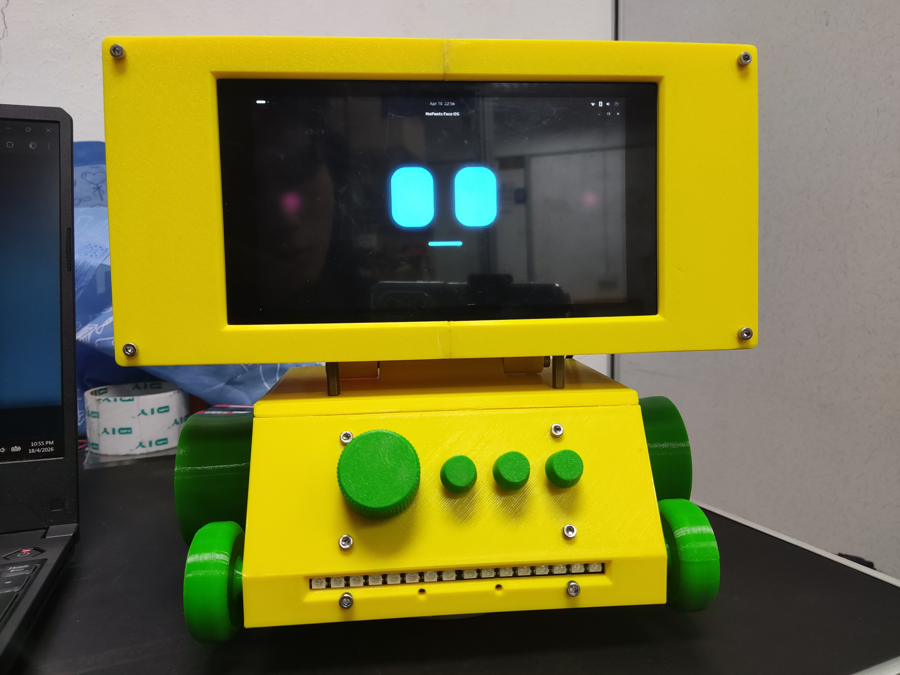

  <h1>🤖 NoPants OS</h1>
  
<b>The AI-Powered, Hardware-Integrated Desktop Assistant</b>

  
  

  

    
    
    
    
  

---

## 🌟 Overview

NoPants OS is not just a standard chatbot—it is a comprehensive **Task Execution Engine**. It bridges the gap between software logic and physical hardware, acting as a proactive tabletop companion. 

By utilizing a custom Python WebSockets server, NoPants interprets complex voice commands, controls physical hardware arrays, and renders a real-time Glassmorphism holographic UI.

### ✨ Key Capabilities
* **🧠 Dual-Brain Architecture:** Lightning-fast cloud inference (Groq API) with an automatic failover to local, offline LLMs (Ollama) if the internet drops.
* **⚡ Smart Hardware Bridge:** An ESP32 running FreeRTOS translates AI intents into servo movements, RGB Neopixel states, and wireless ESP-NOW smart home commands.
* **📅 Proactive Assistant:** Autonomously monitors Google Calendar, triggering panic sequences and alarms to warn you of upcoming meetings.
* **🎮 Custom Web Arcade:** Features fully playable HTML5 Canvas games controlled physically by the robot's rotary knobs and buttons.

---

## 📚 Documentation Directory

To keep this repository clean, the detailed technical breakdowns of NoPants' subsystems have been divided into the following documents:

* 🧠 **[Architecture & AI Logic](docs/ARCHITECTURE.md):** Deep dive into the Dual-Brain routing, the JSON Master Task Queue, and the Piper offline TTS engine.
* 🚀 **[Features & Capabilities](docs/FEATURES.md):** Detailed code snippets of the UI Dashboards, Proactive Calendar Monitor, Live Weather extraction, and VLC Music Queue.
* 🔌 **[Hardware & ESP32 Firmware](docs/HARDWARE.md):** Schematics, FreeRTOS dual-core logic, ESP-NOW smart home networking, and physical UI overrides.
* ⚙️ **[Setup & Installation Guide](docs/SETUP_GUIDE.md):** Step-by-step instructions on how to install dependencies, configure API keys, and boot NoPants OS on a Raspberry Pi.

---

## 👁️ The Persona Interface

The system features a dynamically animated face running in Chromium Kiosk Mode on the robot's display. It utilizes CSS state machines, automatically syncing eye-blinking, mouth-moving, and head-bobbing animations to the audio and hardware events emitted by the Python core.

  

---

## 👨‍💻 About the Developer

Designed and engineered by **William Teow Wei Liang**, a Mechatronics Engineering student at Universiti Sains Malaysia (USM). 

This project was created to explore the intersection of artificial intelligence, full-stack web development, and embedded hardware systems. 

*If you found this architecture interesting or helpful, feel free to drop a ⭐ on the repository!*
