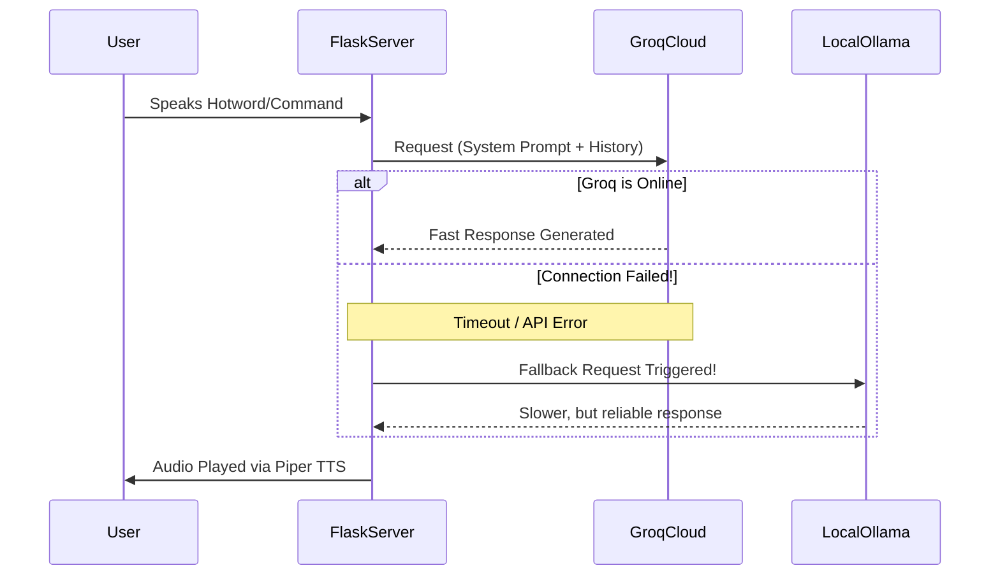
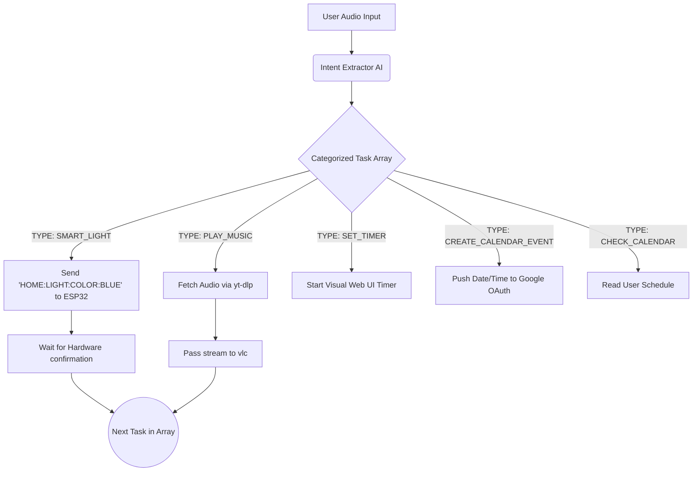

# 🧠 The Mind of NoPants (System Architecture)

NoPants isn't just a chatbot; it's a completely autonomous task-execution engine. This document breaks down the tech stack and the decision-making pipelines that make the robot feel alive.

---

## 🛠️ The Technology Stack

| Component | Technology Used | Purpose |
| :--- | :--- | :--- |
| **Backend Server** | Python, Flask, SocketIO | Serves the web UI and handles all hardware/software asynchronous events. |
| **Cloud AI (Primary)** | Groq API (`llama-3.1-8b-instant`) | Provides lightning-fast intelligence, entity extraction, and conversational personality. |
| **Local AI (Fallback)** | Ollama (`llama3.2:1b`) | Takes over instantly if the internet drops, ensuring the hardware never fully dies. |
| **Voice Engine** | Piper TTS | Generates high-quality, completely offline text-to-speech audio with auto-healing models. |
| **Audio Processing** | SoX (`play`), `cvlc`, ALSA (`amixer`) | Pitch-shifts the Piper TTS to sound like a cartoon. Streams YouTube audio and controls system volume. |
| **Web Frontend** | HTML/Vanilla JS, Kiosk Chromium | Renders the animated face, the dashboard, and custom arcade games in full-screen. |
| **Microcontroller** | ESP32 | Controls physical servos, RGB LEDs, and accepts rotary/button inputs via Serial (`/dev/ttyUSB0`). |

---

## 🚦 Dual-Brain Decision Flow

NoPants defaults to the blazing-fast Groq Cloud API. However, a constant ping/wrapper detects if the API is unreachable. If it fails, all prompts effortlessly route to a lightweight Llama 3 model running locally on the device via Ollama. 

---

## 🏗️ The 4-Tier Audio Router

Every time the user speaks, the server processes the `user_prompt` through an explicit, heavily-optimized 4-Tier Routing System (`handle_llm`) before triggering the LLMs:
1. **Tier 1 (Instant Overrides):** Hardcoded killswitches (`"stop music"`, `"shut up"`) that instantly terminate subprocesses to save system resources.
2. **Tier 2 (Hardcoded Apps):** Direct routing for non-LLM utility pipelines like `/game` transitions, `"study mode"`, or instant `wttr.in` weather checks.
3. **Tier 3 (Master Task Agent):** Complex logic pipeline (see below). Triggered by keyword regex maps (`["light", "calendar", "queue", ...]`).
4. **Tier 4 (Default Conversation):** If no keywords match, the prompt gets sent to the standard conversational LLM.

---

## 🦾 The "Master Task Agent" Pipeline

When you ask NoPants to do something complex (Tier 3), it doesn't just "talk back". It uses a separate LLM call dedicated to extracting intent. The Master Agent converts your sentence into an explicit array of JSON tasks.

### Auto-Healing Architecture
One of the most robust features of the system is the **Piper Auto-Healer**. Large LLM and TTS `.onnx` models are prone to corruption. On boot, the server checks the physical file size of the voice models. If they are missing or corrupted, the system automatically pulls clean binaries from HuggingFace, preventing a fatal crash.
