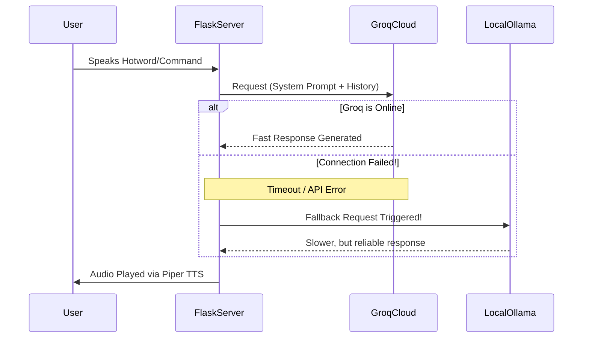
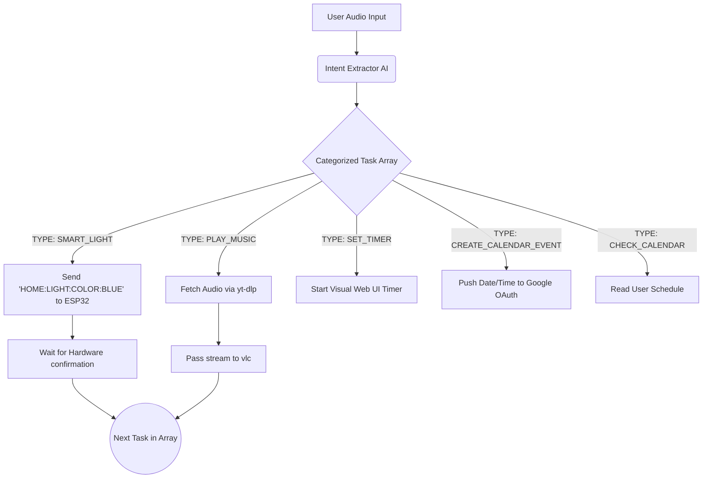

# 🧠 The Mind of NoPants (System Architecture)

NoPants isn't just a chatbot; it's a completely autonomous task-execution engine. This document breaks down the tech stack, the decision-making pipelines, and the actual Python code that makes the robot feel alive.

---

## 🛠️ The Technology Stack

| Component | Technology Used | Purpose |
| :--- | :--- | :--- |
| **Backend Server** | Python, Flask, SocketIO | Serves the web UI and handles all hardware/software asynchronous events. |
| **Cloud AI (Primary)** | Groq API (`llama-3.1-8b-instant`) | Provides lightning-fast intelligence, entity extraction, and conversational personality. |
| **Local AI (Fallback)** | Ollama (`llama3.2:1b`) | Takes over instantly if the internet drops, ensuring the hardware never fully dies. |
| **Voice Engine** | Piper TTS | Generates high-quality, completely offline text-to-speech audio with auto-healing models. |
| **Audio Processing** | SoX (`play`), `cvlc`, ALSA (`amixer`) | Pitch-shifts the Piper TTS to sound like a cartoon. Streams YouTube audio and controls system volume. |
| **Web Frontend** | HTML/Vanilla JS, Kiosk Chromium | Renders the animated face, the dashboard, and custom arcade games in full-screen. |
| **Microcontroller** | ESP32 | Controls physical servos, RGB LEDs, and accepts rotary/button inputs via Serial (`/dev/ttyUSB0`). |

---

## 🚦 1. The 4-Tier Command Router (Traffic Cop)

To prevent "spaghetti code" and save API tokens, NoPants does not send every user prompt directly to the LLM. Instead, the `handle_llm` function acts as a strict 4-Tier traffic cop. It analyzes the raw text and routes it to the most efficient processing function.

1. **Tier 1 (Instant Overrides):** Hardcoded killswitches (`"stop music"`, `"shut up"`) that instantly terminate subprocesses to save system resources.
2. **Tier 2 (Hardcoded Apps):** Direct routing for non-LLM utility pipelines like `/game` transitions, `"study mode"`, or instant `wttr.in` weather checks.
3. **Tier 3 (Master Task Agent):** Complex logic pipeline triggered by keyword regex maps (`["light", "calendar", "queue", ...]`).
4. **Tier 4 (Default Conversation):** If no keywords match, the prompt gets sent to the standard conversational LLM.

**The Routing Code:**
```python
@socketio.on('llm_request')
def handle_llm(data):
    user_prompt = data['prompt'].lower()

    # TIER 1: Instant Hardware Overrides (0 Latency, No AI)
    if "stop music" in user_prompt or "shut up" in user_prompt:
        music_queue.clear()
        socketio.emit('music_stop')
        return

    # TIER 2: Hardcoded App Triggers (Fast execution for specific tools)
    if "weather" in user_prompt:
        socketio.start_background_task(process_weather_logic, user_prompt)
        return

    # TIER 3: The Master Task Agent (Complex multi-step actions)
    queue_triggers = ["light", "timer", "music", "calendar", "alarm", "search"]
    if any(word in user_prompt for word in queue_triggers):
        socketio.start_background_task(process_master_queue_logic, user_prompt)
        return

    # TIER 4: Default Conversational Chat
    socketio.start_background_task(ask_ai_in_background, user_prompt)
```

---

## 🔀 2. Dual-Brain Decision Flow (Cloud + Local Fallback)

Internet drops happen. APIs go down. To ensure NoPants never freezes or crashes when you need him, the system utilizes a **Dual-Brain Architecture**.

NoPants defaults to the blazing-fast Groq Cloud API. However, every LLM call is wrapped in a strict `try/except` block. If a timeout or API failure occurs, the exception is caught, and the exact same system prompt is silently redirected to a local `llama3.2:1b` model running on `localhost:11434`.



**The Fallback Code:**
```python
try:
    # 1. ATTEMPT CLOUD BRAIN (GROQ)
    chat_completion = groq_client.chat.completions.create(
        messages=api_messages,
        model="llama-3.1-8b-instant",
        temperature=0.7 
    )
    bot_reply = chat_completion.choices[0].message.content
    
except Exception as e:
    print(f"Cloud Chat Failed: {e}. WAKING UP LOCAL BRAIN!")
    
    try:
        # 2. LOCAL FALLBACK BRAIN (OLLAMA)
        local_payload = {
            "model": "llama3.2:1b",
            "messages": api_messages,
            "stream": False
        }
        response = requests.post("http://localhost:11434/api/chat", json=local_payload, timeout=10)
        bot_reply = response.json()['message']['content']
        
    except Exception as local_e:
        bot_reply = "My cloud connection is dead, and my local brain is asleep."
```

---

## 🦾 3. The "Master Task Agent" Pipeline

When you ask NoPants to do something complex (e.g., *"Set the lights to red, wait 5 seconds, then play some lofi music"*), traditional NLP fails. 

Instead, NoPants uses a highly-tuned **System Prompt** that forces the LLM to output a strict JSON array of sequential tasks. Python then parses this array and executes it natively.



### The Double-Talk Filter & Execution Loop
LLMs occasionally hallucinate and duplicate their responses across both `spoken_reply` and `SPEAK` tasks. The execution pipeline features a "Bulletproof Double-Talk Filter" to catch this before iterating through the tasks.

```python
def process_master_queue_logic(user_prompt):
    command_list, spoken_reply = extract_master_queue(user_prompt, chat_history)
    
    # --- BULLETPROOF DOUBLE-TALK FILTER ---
    if spoken_reply:
        # Check if the AI scheduled ANY 'SPEAK' tasks in the array.
        has_speak_task = any(step.get("type") == "SPEAK" for step in command_list)
        
        # Only say the general reply if there isn't a dedicated SPEAK task coming up
        if not has_speak_task:
            speak(spoken_reply)
            
    for step in command_list:
        task_type = step.get("type", "")
        
        if task_type == "SMART_LIGHT":
            send_to_hardware(step.get("command", ""))
            
        elif task_type == "CREATE_CALENDAR_EVENT":
            parsed_time = datetime.datetime.strptime(step.get("time"), "%Y-%m-%d %H:%M")
            add_to_google_calendar(step.get("title"), parsed_time)
            
        elif task_type == "PLAY_MUSIC":
            music_queue.append(step.get("query", ""))
            socketio.start_background_task(play_next_in_queue)
```

---

## 🛠️ 4. Fully Offline TTS & Auto-Healing Architecture

NoPants uses **Piper TTS** for high-quality, fully offline speech generation, processed locally on the Raspberry Pi CPU to avoid API latency.

Because users might accidentally delete `.onnx` voice models, or Git might fail to clone large files (LFS limits), the TTS engine features an **Auto-Healing Initialization Block**. Before generating speech, the system checks the file size. If it detects corruption or missing files, it dynamically parses the expected filename, constructs the HuggingFace URL, and initiates a `wget` sequence to repair itself.

```python
# ---> THE STRICT AUTO-HEALER <---
needs_healing = False
if not os.path.exists(voice_model) or os.path.getsize(voice_model) < 15000000:
    needs_healing = True
    
if needs_healing:
    print("[SYSTEM] Auto-downloading missing voice models from HuggingFace...")
    
    # Break apart the filename to dynamically build the URL
    filename = os.path.basename(voice_model) 
    region = filename.split('-')[0]          
    voice_name = filename.split('-')[1]      
    language = region.split('_')[0]          
    
    base_url = f"[https://huggingface.co/rhasspy/piper-voices/resolve/main/](https://huggingface.co/rhasspy/piper-voices/resolve/main/){language}/{region}/{voice_name}/medium"
    os.system(f'wget -q -O {voice_model} "{base_url}/{filename}?download=true"')

# Execute Audio via ALSA and SoX
turbo_cmd = f'echo "{safe_text}" | ./piper/piper --model {voice_model} --output_raw | play -q -t raw -r 22050 -e signed -b 16 -c 1 - pitch +450 tempo 1.0 2>/dev/null'
os.system(turbo_cmd)
```

---

## 🌐 5. Flask-SocketIO Web State Machine

Instead of hardcoding complex GUI graphics in Python, NoPants outsources all UI rendering to Chromium Kiosk Mode. Python simply acts as a state director, emitting signals via `Flask-SocketIO` to tell the HTML frontend what to do.

By pushing CSS classes dynamically via JavaScript, the robot can transition states smoothly without heavy hardware rendering logic.

**Python Backend (Emitting State):**
```python
socketio.emit('music_start') 
socketio.emit('llm_response', {'response': text})
```

**JavaScript Frontend (Catching & Animating):**
```javascript
socket.on('music_start', () => {
    // Triggers CSS keyframe head-bobbing animations
    document.body.classList.add('jamming'); 
});

socket.on('llm_response', (data) => {
    // Awakens the robot face and triggers mouth CSS animations
    document.body.classList.add('talking');
    document.getElementById('subtitle').innerText = data.response;
});
```
