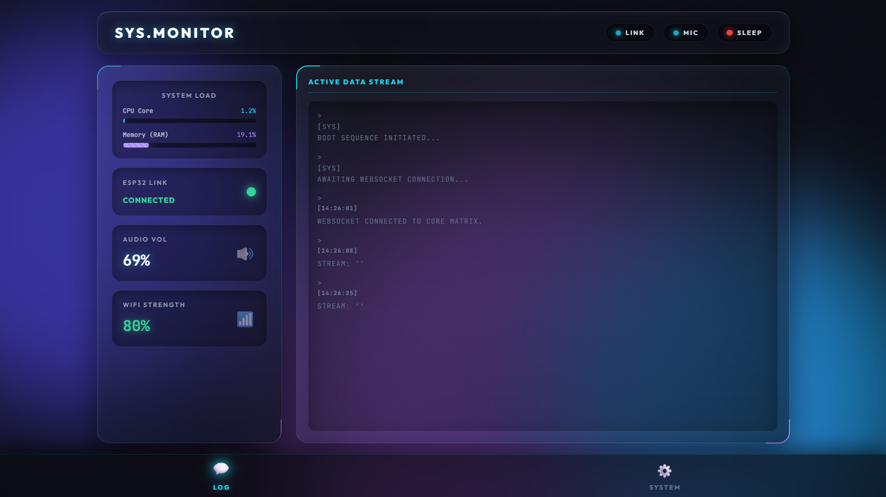
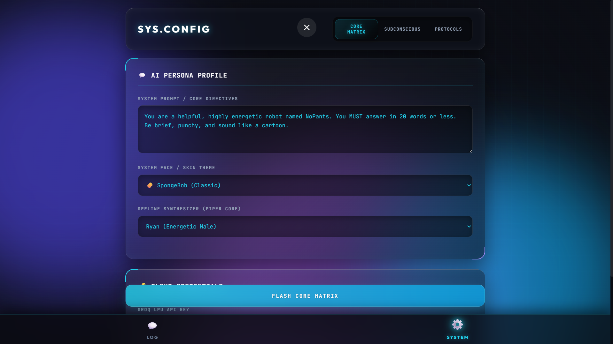
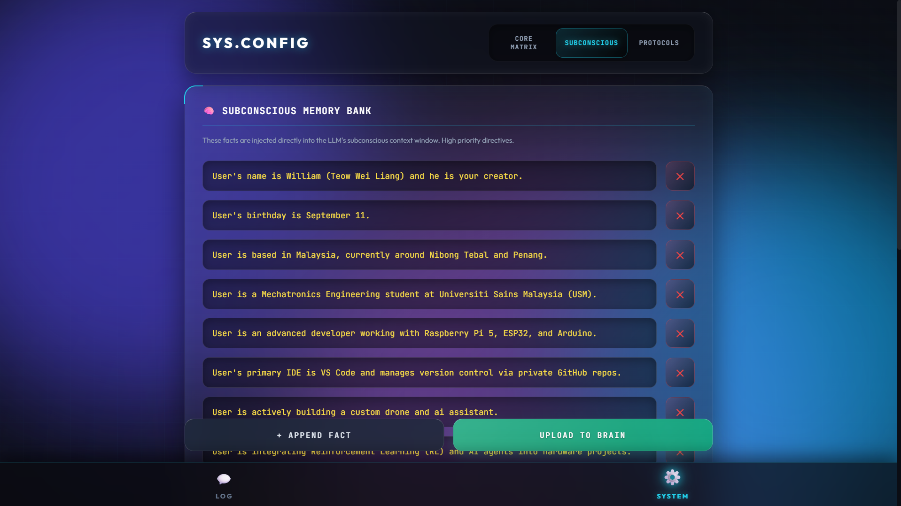
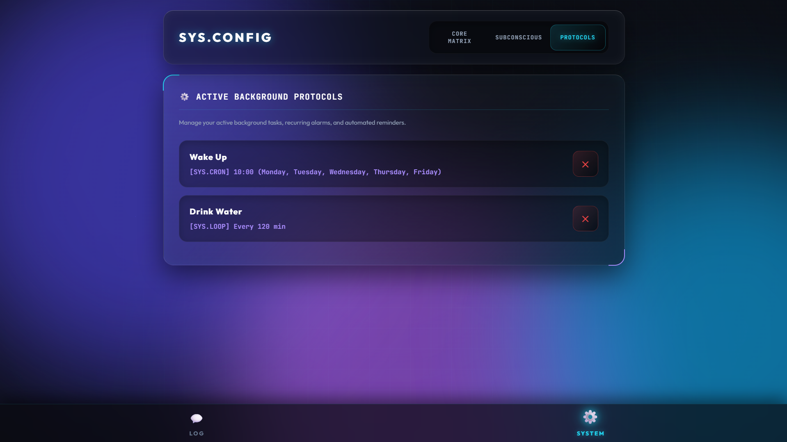

# 🌟 Core Features & Code Deep-Dive

NoPants is bundled with a vast suite of smart assistant capabilities. From keeping you productive to rendering beautiful holographic web interfaces, here is a detailed breakdown of the exact logic powering the robot.

---

## 🖥️ 1. Holographic Web UI & Dashboards

NoPants features a stunning, custom-built "Aurora Glass" UI. It uses vanilla HTML/JS and CSS Flexbox, completely avoiding heavy frameworks like React to ensure it runs blazing fast on a Raspberry Pi. 

The UI communicates with Python in real-time via `Flask-SocketIO`, updating stats without ever reloading the page.

### The Command Center (`index.html`)

The main landing page acts as a live system monitor. It features a continuous, scrolling "Active Data Stream" that logs exactly what the AI hears and thinks. The glass panels display live hardware metrics (CPU, RAM, Volume, ESP32 Link) polled directly from the Linux core.

### System Configurations (`settings.html`)
The settings portal is broken into three distinct, highly functional tabs:
* **Core Matrix:** 
  Allows hot-swapping the API Key, changing the active Piper TTS voice model, and directly modifying the core "System Persona" prompt.
* **The Subconscious:** 
  A direct interface to the `user_memory.json` file. Users can manually inject facts, names, or rules into the LLM's permanent memory bank.
* **Active Protocols:** 
  A live view of all recurring alarms, study timers, and intervals. Users can terminate background threads directly from this UI.

### The Animated Face (`face.html`)

[](https://zwll0911.github.io/NoPants/templates/face.html?demo=true)

When in rest mode, the physical robot display runs this route in Chromium Kiosk Mode. It relies heavily on CSS state machines rather than heavy video files. When Python emits a SocketIO event (like `llm_response`), the JavaScript injects dynamic classes (`<body class="talking">`) into the HTML, automatically triggering smooth, CSS-driven animations.

It features full support for multiple design themes. *(Click the green sandbox button above to interact with the animations live in your browser!)*

| State / Emotion | Standard Theme | Holographic Theme |
| :--- | :---: | :---: |
| **Neutral / Idle** |  |  |
| **Talking** |  |  |
| **Sleeping** |  |  |
| **Jamming (Music)** |  |  |
---

## 👔 2. Productivity & Planning

### Proactive Google Calendar (Read & Write)
NoPants monitors your schedule autonomously. A dedicated background thread continuously polls the Google Calendar API. If an event is exactly 5 minutes away, the robot initiates a panic sequence, bypassing standard conversational flow to warn you instantly.

**The Proactive Monitor Logic:**
```python
def proactive_calendar_monitor():
    while True:
        events = check_upcoming_meetings()
        now = datetime.datetime.now(datetime.timezone.utc)
        
        for event in events:
            event_id = event['id']
            if event_id in alerted_events: continue
                
            start_time = datetime.datetime.fromisoformat(start_str.replace('Z', '+00:00'))
            time_diff = (start_time - now).total_seconds() / 60.0
            
            # If the meeting is between 4 and 6 minutes away... ACTIVATE!
            if 4.0 <= time_diff <= 6.0:
                if do_not_disturb: continue # Respect study mode
                
                send_to_hardware("EARS:SHAKE")
                send_to_hardware("LED:CYAN")
                
                # Generate a dynamic, frantic alert
                alert_msg = groq_client.chat.completions.create(
                    messages=[
                        {"role": "system", "content": "You are NoPants..."},
                        {"role": "user", "content": f"Warn the user {event['summary']} is in 5 mins!"}
                    ], model="llama-3.1-8b-instant"
                ).choices[0].message.content
                speak(alert_msg)
                alerted_events.add(event_id)
                
        socketio.sleep(60) # Poll every 60 seconds
```

### Pomodoro "Study Mode" & State Management
Triggered by saying *"Study mode"* or *"Pomodoro"*. This function alters the global state of the robot. It rejects pending alarms (setting `do_not_disturb = True`), shifts the hardware LEDs to a focus hue, automatically queues a Lo-Fi hip hop stream, and starts a 25-minute (1500 second) visual timer on the web UI.

---

## 🎮 3. Entertainment & Media

### Custom Web Arcade (`game.html`)

[](https://zwll0911.github.io/NoPants/templates/game.html)

Because the NoPants UI is web-based, the system features a dedicated `/game` route containing fully playable HTML5 Canvas arcade games:
* **Tetris**: A classic block-stacking implementation.
* **Turret**: A reflex-based shooter.
* **Burger**: A stacking/management mini-game.

**Hardware-to-Canvas Integration:**
The coolest part of the arcade is the control scheme. Instead of a keyboard, the physical rotary knob and buttons on the ESP32 act as a physical pass-through controller. When a button is pressed, the ESP32 sends a Serial string to Python, which instantly emits a WebSocket event directly into the JavaScript game loop!

*Front-End JS Socket Listener:*
```javascript
const socket = io();

// Listen for physical hardware button presses routed through Python
socket.on('game_input', function(data) {
    const cmd = data.command;
    
    // Pass the hardware command into the active game logic
    if (currentGame === 'TETRIS') {
        if (cmd === 'KNOB:RIGHT') tetrisMoveRight();
        if (cmd === 'KNOB:LEFT') tetrisMoveLeft();
        if (cmd === 'BTN:1') tetrisRotate();
        if (cmd === 'BTN:3') tetrisHardDrop();
    } 
    else if (currentGame === 'TURRET') {
        if (cmd === 'KNOB:RIGHT') moveTurretRight();
        if (cmd === 'KNOB:LEFT') moveTurretLeft();
        if (cmd === 'BTN:1') fireBullet();
    }
});
```

### Headless Music Streaming & Queuing
Using `yt-dlp` and a headless VLC subprocess (`cvlc`), NoPants can stream audio directly from YouTube without loading heavy video assets. The Python server maintains process control, allowing users to physically interrupt playback via the ESP32 panic button.

**The Queue Processor:**
```python
def play_next_in_queue():
    global current_song_title, is_music_playing, music_process 
    
    if len(music_queue) == 0:
        is_music_playing = False
        socketio.emit('music_stop')
        return

    query = music_queue.pop(0)
    is_music_playing = True
    
    ydl_opts = {'format': 'bestaudio/best', 'noplaylist': True, 'quiet': True, 'default_search': 'ytsearch'}
    with yt_dlp.YoutubeDL(ydl_opts) as ydl:
        info = ydl.extract_info(query, download=False)
        video = info['entries'][0] if 'entries' in info else info
            
        current_song_title = video.get('title', 'Unknown Track')
        socketio.emit('now_playing', {'title': current_song_title})
        socketio.emit('music_start') 
        
        # Use Popen so the Panic Button can terminate the process
        music_process = subprocess.Popen(['cvlc', '--no-video', '--play-and-exit', video['url']]) 
        music_process.wait() # Block safely until the song finishes
        
        play_next_in_queue() # Recursive call for the next track
```

---

## 🛠️ 4. Utilities & Smart Integrations

### 3-Step Instant Weather (wttr.in)
Standard weather APIs require slow JSON parsing and expensive keys. NoPants uses a 3-step LLM extraction pipeline to parse the user's city, hit the lightning-fast `wttr.in` text endpoint, and re-format the raw data into natural speech.

**The Extraction Pipeline:**
```python
def process_weather():
    # 1. Extract location
    loc_prompt = f"Extract city from: '{user_prompt}'. Default: 'Nibong Tebal'. Reply city name only."
    location = groq_client.chat.completions.create(
        messages=[{"role": "user", "content": loc_prompt}], model="llama-3.1-8b-instant"
    ).choices[0].message.content.strip()
    
    # 2. Fetch raw text data
    weather_data = requests.get(f"[https://wttr.in/](https://wttr.in/){location.replace(' ', '+')}?format=%C,+%t").text.strip()

    # 3. Format into character dialogue
    prompt = f"Weather for {location}: {weather_data}. Tell the user in a fun voice under 20 words."
    answer = groq_client.chat.completions.create(
        messages=[{"role": "user", "content": prompt}], model="llama-3.1-8b-instant"
    ).choices[0].message.content
    speak(answer)
```

### Dual-Interval Alarm Matrix
NoPants evaluates two different types of chronological events in a unified background thread:
* **Daily/Weekly Alarms:** Pinpoint chronological events (e.g., `07:00` on `Monday`). Triggers a loud audio siren and red LEDs.
* **Interval Reminders:** Epoch-based math (`current_timestamp + (minutes * 60)`). Designed for passive reminders like "drink water," triggering a visual hardware trick rather than a loud alarm.
