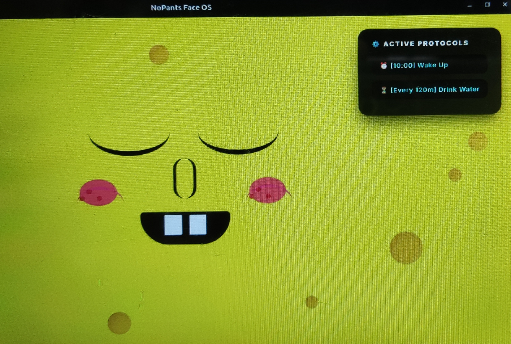
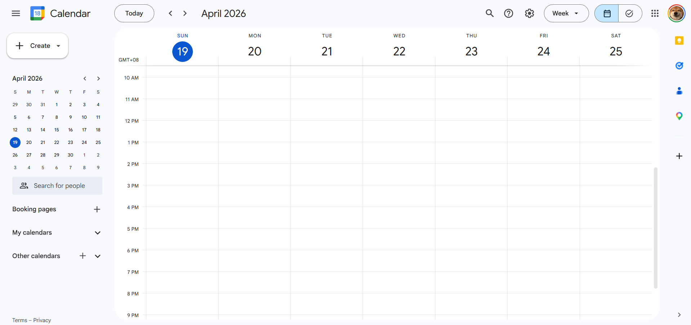
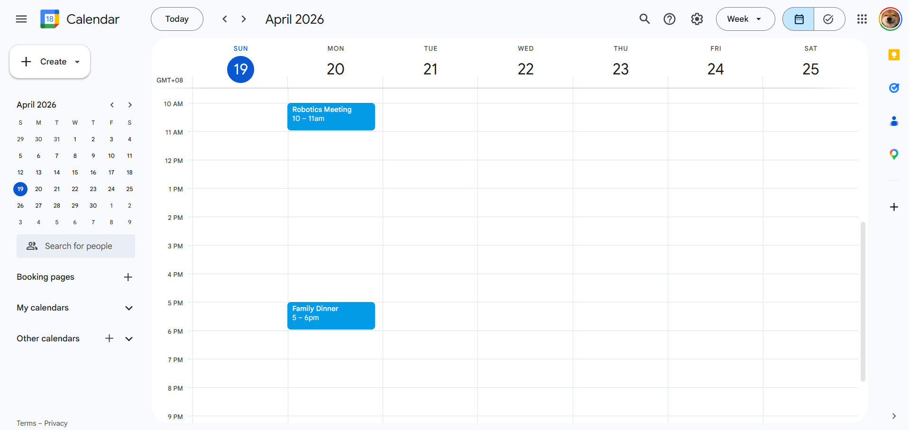

# 🌟 Complete Features Breakdown

NoPants is bundled with a vast suite of smart assistant capabilities. From keeping you productive to entertaining your guests, here is everything the robot can do.

---

## 👔 Productivity & Planning

> **Active Protocols:** The NoPants dashboard UI.

### Google Calendar (Read & Write)
NoPants monitors your calendar autonomously. Exactly 5 minutes before a scheduled event, the robot initiates a panic sequence (shaking its ears, blinking LEDs) and uses the local LLM to generate a customized, frantic voice alert warning you not to be late. 

**NEW:** Thanks to the `CREATE_CALENDAR_EVENT` action pipeline, NoPants can seamlessly schedule new meetings conversationally. Just ask it to create an event, and it automatically extracts the time and pushes it to your Google Workspace!

### Pomodoro "Study Mode"

Triggered by saying *"Study mode"* or *"Pomodoro"*. This function:
1. Rejects all pending alarms/calendar alerts (Do Not Disturb is set to True).
2. Sets the hardware LEDs to a calm orange/ambient hue.
3. Automatically queries YouTube for a "lofi hip hop radio" stream and plays it seamlessly.
4. Starts a 25-minute visual timer on the robot's face. 
5. When complete, flashes green and celebrates verbally.

### Persistent Conversational Memory
NoPants remembers who you are. The LLM extracts specific names, relationships, and preferences during casual conversation and logs them into a local `user_memory.json` file. It only keeps the 30 most recent facts to prevent context bloat, constantly injecting these facts into the system prompt.

---

## 🎮 Entertainment & Media

> **Responsive UI:** The robot face synchronizes dynamically with AI output.

### Custom Web Arcade Dashboard

Built entirely from scratch, NoPants features a dedicated `/game` web route containing custom graphical games:
* **Tetris**: A classic block-stacking implementation.
* **Turret**: A reflex-based shooter.
* **Burger**: A stacking/management mini-game.
The server maintains a global leaderboard. The underlying hardware buttons on the ESP32 can act as physical pass-through controllers for these web applications!

### Music Streaming & Queuing Pipeline

Using `yt-dlp` and `cvlc`, you can ask the robot to "Play [Song]". It bypasses ads and streams the audio buffer immediately. It supports queuing arrays of songs ("play this next") and even audio introspection ("what song is playing right now?").

### The "Party Trick" Button

Pressing the physical Button 3 triggers a party mode. The ESP32 flashes the LEDs hot pink and starts shaking the ears. The AI immediately crafts a bizarre, 1-sentence joke or fun fact based on your personal memories and delivers it with a punchy delivery.

---

## 🛠️ Utilities & Smart Home

### Dynamic DuckDuckGo Searching

Using the `DDGS` library, the robot can scrape the top 3 live web results from the past 7 days for any given query. It then feeds the raw text back to the LLM to summarize the findings into a 30-word cartoon snippet.

### wttr.in Instant Weather

By combining the NLP capabilities of the LLM (to extract city names from conversational text) and the lightning-fast API of `wttr.in`, NoPants can provide live temperature checks for any location globally.

### Dual-Interval Alarm Matrix

NoPants maintains a background thread dedicated exclusively to checking an `alarms.json` array. It supports:
* **Daily/Weekly Alarms**: Pinpoint times like "7 AM every Monday".
* **Hourly Reminders**: Repeating interval loops like "Remind me to drink water every 2 hours" that flash the LEDs instead of triggering loud sirens.
